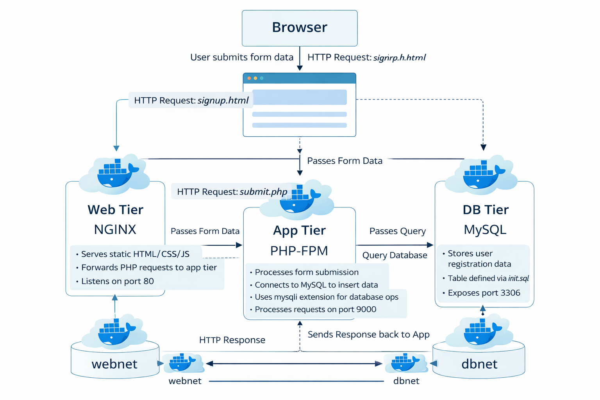
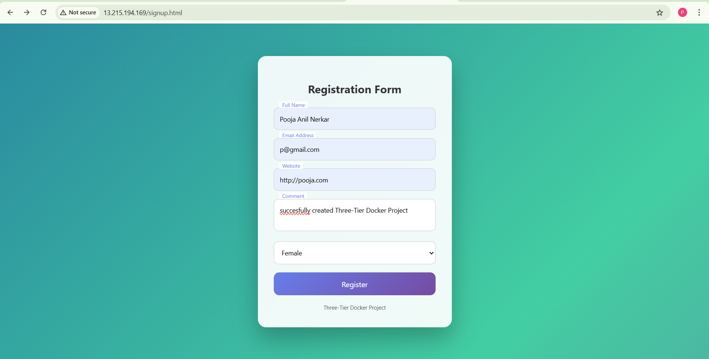
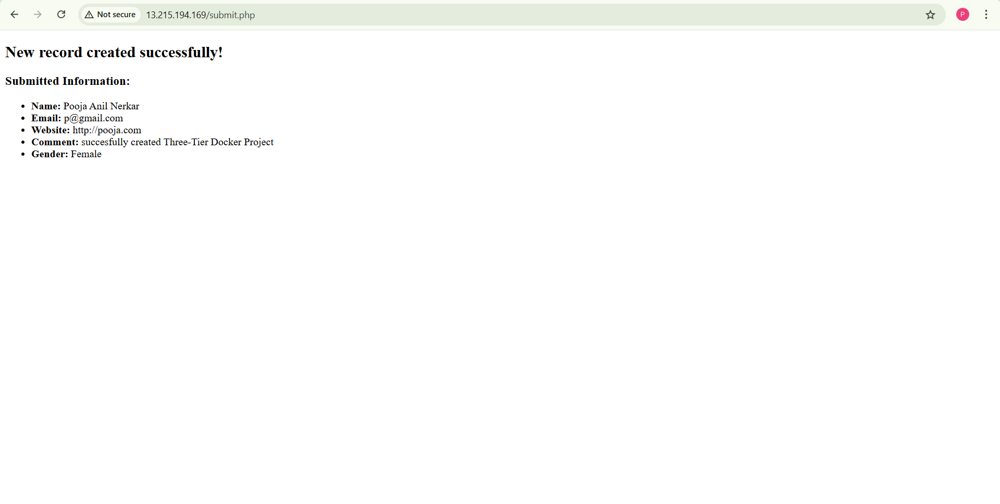
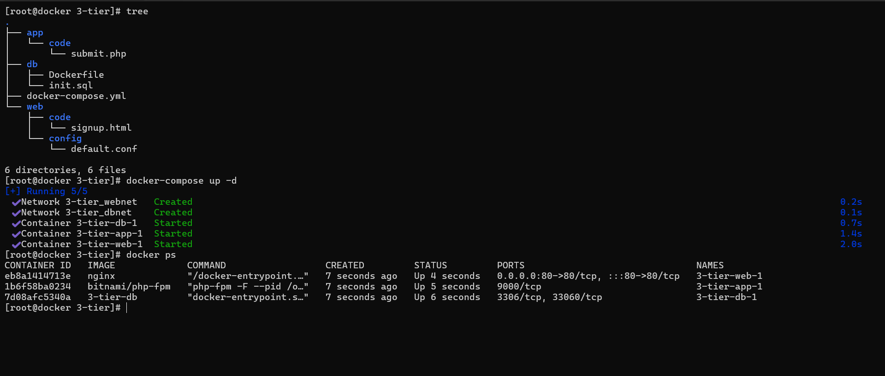

# Three-Tier Web Application using Docker

A fully containerized **three-tier web application** built using Docker, demonstrating clear separation of concerns between the **frontend**, **backend**, and **database** layers.  
The project showcases real-world DevOps fundamentals such as container networking, service isolation, and scalable architecture.

---

## 🚀 Features

- Three-tier architecture (Web, Application, Database)
- Dockerized deployment using `docker-compose`
- NGINX as web server
- PHP-FPM for backend processing
- MySQL database with persistent storage
- Colorful, modern, and responsive registration UI
- Successful data flow from UI → PHP → MySQL

---

## 🛠️ Technologies Used

- **Docker**
- **Docker Compose**
- **NGINX**
- **PHP (PHP-FPM)**
- **MySQL**
- **HTML5 & CSS3**
- **Linux**

---

## 📂 Project Structure

```text
3-tier/
├── app
│   └── code
│       └── submit.php
├── db
│   ├── Dockerfile
│   └── init.sql
├── web
│   ├── code
│   │   └── signup.html
│   └── config
│       └── default.conf
├── docker-compose.yml


---

## 🧩 Architecture Overview




**Flow:**
1. User accesses the registration page via browser.
2. NGINX serves the frontend (`signup.html`).
3. Form data is sent to `submit.php`.
4. PHP-FPM processes the request.
5. Data is stored in MySQL database.
6. Response is sent back to the user.

---

## 🖼️ Screenshots

### 🔹 Registration Page (Frontend UI)


### 🔹 Successful Form Submission


### 🔹 Project Structure & Docker Containers
*(Shows folder tree structure and running Docker containers in a single view)*  


---

## ⚙️ Implementation Steps

1. Created a three-tier folder structure separating web, app, and database layers.
2. Configured **NGINX** to serve static content and forward PHP requests to PHP-FPM.
3. Implemented backend logic using **PHP** to handle form submission.
4. Created **MySQL database and table** using `init.sql`.
5. Connected all services using Docker networks (`webnet` and `dbnet`).
6. Deployed the application using `docker-compose`.
7. Enhanced the frontend UI with modern CSS, animations, and responsive design.
8. Verified successful data insertion into the database.

---

## ▶️ How to Run the Project

```bash
docker-compose up -d
Access the application in your browser:

http://<server-ip>/signup.html

✅ Result

Registration form loads successfully.

User data is stored in the MySQL database.

Application runs smoothly across containers.

Frontend and backend remain independently manageable.

👩‍💻 Author

Pooja Nerkar
